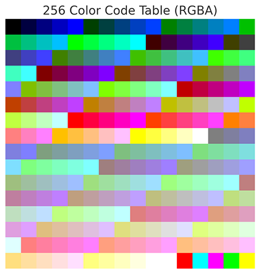

# SG-Engine2D  
Simple Game 2D Engine 是我的写的一个简易的游戏物理引擎，其中包括一些2D游戏所具备的基础功能。  
  
## 功能介绍：  
- 主要实现：  
  本项目提供的功能只支持平面俯视视角的游戏，不支持加速度等功能。  
  
- 碰撞系统：  
  本项目的碰撞全部基于长方形的顶点检查，也就是只支持矩形，不支持圆形，不规则图形等形状。  

- 视锥功能：  
  可以让角色拥有可见（或不可见）的视野范围，让各个实体之间的视野检测更易实现。  

- 像素模型：  
  本项目提供了一个可以手动输入像素数据，或者在我的[Pixel-ImageCompress](https://github.com/qinmoM/Pixel-ImageCompress)项目中将图片压缩为像素数据，从而实现不依赖图片文件就可以绘制简单的像素画面的功能。  
  其颜色大小被压缩为一个字节，所以颜色的精度受限。  
  
## 使用方法：  
- 需要在main中实例化一个Scene对象，并且调用draw,updata等函数，这些函数可以根据自己的需求自行在Scene中实现。  
  
- 不同游戏内容基本都要在Scene类进行扩展，比如不同的地图，图像等。  
  
- 如果使用内置的像素绘图功能可以根据此图进行颜色的调整。  
  （图片由ChatGPT生成）  
  
## 目录结构：  
- Map.h/Map.cpp：  
  可以用于任何图形库的游戏数据结构，这里只给出了raylib的接口，其他图形库可以在Scene.cpp中修改或者实现对应的接口和函数。  
  
- Scene.h/Scene.cpp：  
  基于raylib图形库，给出的main与Map之间的接口。可以修改为其他图形库的接口。  
  
- RaylibTools.h/RaylibTools.cpp：  
  自己制作的raylib图形库制作的工具类，可以在开发中更方便地使用raylib的函数。  
  
- RaylibPixelModel.h/RaylibPixelModel.cpp：  
  像素模型类，储存一些像素数据，可以绘制简单的像素图片，在项目中可以代替图片。  
  内置了一些像素模型，可以直接使用，也可以自己制作新的像素模型，但是注意不要因模型太大导致卡到障碍物里。  
  只在使用时加载所用的像素数据，不会将全部模型加载到内存中。  
  
- DataManage.h/DataManage.cpp：  
  管理游戏的DMS数据。  
  
- main.cpp：  
  游戏主函数，包含了游戏的主循环。  
  
## 版权声明：  
- 本项目基于raylib图形库实现，其版权归原作者所有。  
  
> 如有任何疑问，请联系作者：<ma200511@qq.com>  
> 项目地址：https://github.com/qinmoM/SG-Engine2D  
> 欢迎讨论。  